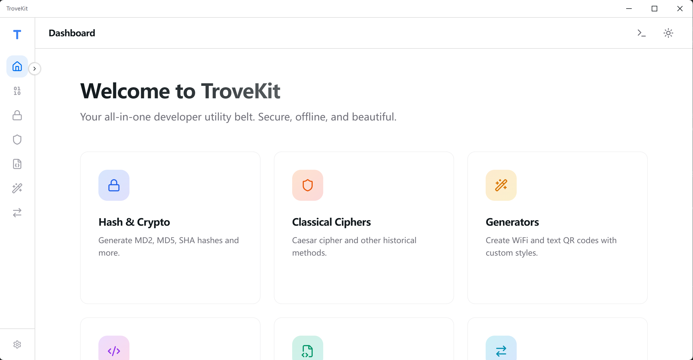
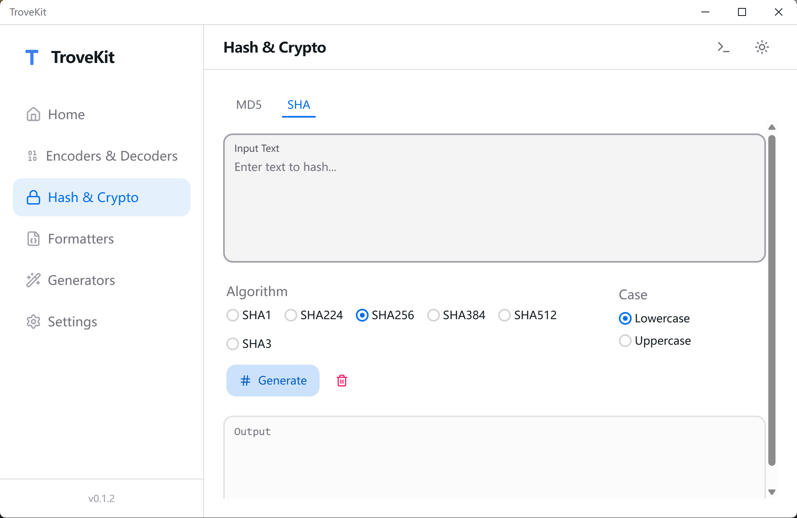
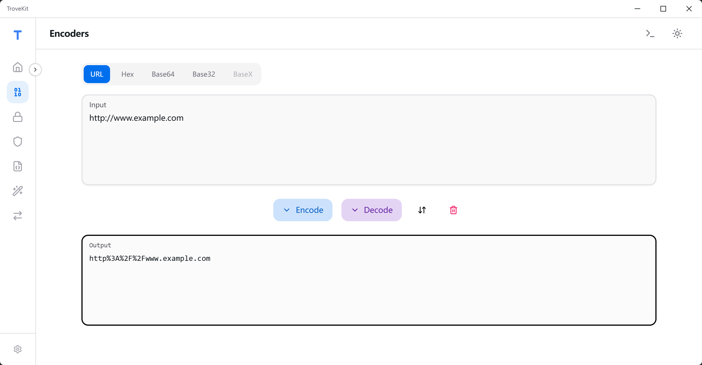
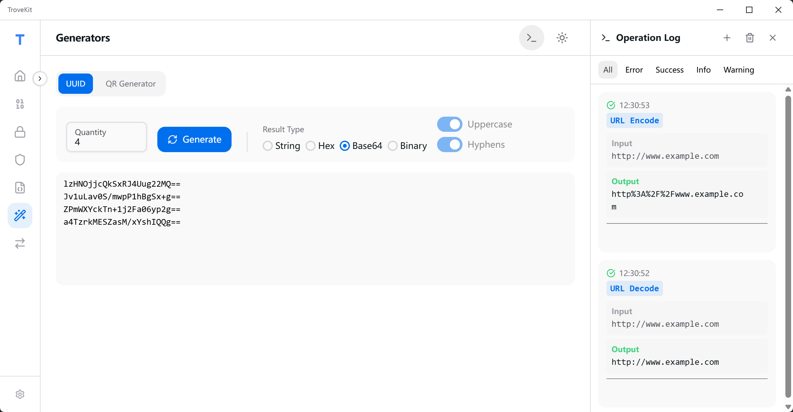
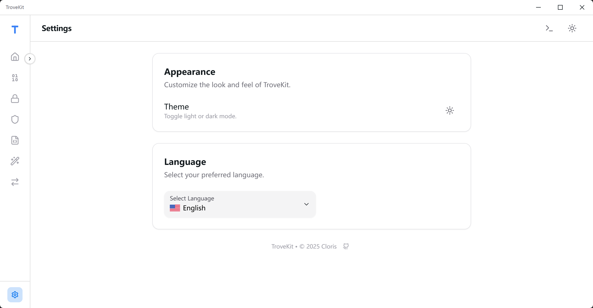

<div align="center">

<h1>TroveKit</h1>

オープンソース、軽量、完全オフライン、クロスプラットフォームのツールボックス。

[English](README.md) | [簡體中文](README.zh-CN.md) | [繁體中文（香港）](README.zh-HK.md) | [繁體中文（台灣）](README.zh-TW.md) | 日本語
</div>

<div align="center">
<a href="https://github.com/1595901624/trovekit/releases"></a>
<a href="https://github.com/1595901624/trovekit/blob/main/LICENSE"></a>


</div>



## TroveKit とは

あなたはおそらくこれらの「小さなユーティリティ」をいつも使っているでしょう—ハッシュ、暗号化/復号化、エンコード/デコード、JSON フォーマット、QR コード、シンプルな古典暗号……
TroveKit はそれらを高速なデスクトップアプリにまとめ、以下を目指します：

- **純粋にオフライン**：すべてのデータ処理はローカルで行われます
- **高速ワークフロー**：即時結果（リアルタイム更新対応）
- **追跡可能**：操作ログ + ワンクリックコピー
- **クロスプラットフォーム**：Windows / macOS / Linux

TroveKit は [Tauri v2](https://v2.tauri.app/) + [React](https://react.dev/) で構築され、TroveKit は純粋にオフラインのワークフローに焦点を当てています。

## ✨ 主な機能

- オールインワンユーティリティ：Hash / AES / DES / RC4 / エンコーダー-デコーダー / JSON / XML / YAML / **コンバーター** / QR / シーザー暗号 / **ログ管理**
- モダン UI：ライト/ダークテーマ、レスポンシブレイアウト、スムーズなアニメーション
- **グローバル機能検索**：アプリケーション全体のツールや機能を素早く検索してナビゲートできます。
- **折りたたみ可能なサイドバー**：サイドバーを切り替えてワークスペースを最大化し、状態を記憶します。
- **拡張国際化**：English / 簡體中文 / 繁體中文（HK/TW）/ 日本語、文字サイズと翻訳品質の最適化
- ログとトースト：履歴、エラーフィードバック、コピーボタン、**メモ機能付き**
- **状態の永続化**：ツール状態の自動保存（入力の損失を防ぐ）

## 🧰 ユーティリティ

### 📷 QR Code Generator

- **テキスト / URL** からの QR コード生成
- **Wi‑Fi QR コード** の生成（SSID / パスワード / 暗号化 / 非表示）
- スタイルのカスタマイズ：色、誤り訂正レベル、オプションのロゴ
- **PNG** へのエクスポート（Unicode 対応）

### 🔐 Classical Ciphers

- **Bacon Cipher**：標準（26文字）または伝統（24文字）のアルファベットによるエンコード/デコード、複数のシンボルモード（A/B、0/1など）をサポート
- **Caesar Cipher**：エンコード/デコード、設定可能なシフト
- **Morse Code**：カスタマイズ可能な設定（区切り文字/長点・短点）
- 非文字処理：保持 / 無視 / ASCII シフト（実験的；印刷不可能な文字を生成する可能性）

### 🔒 Hash & Cryptography

- **MD5 / MD4 / MD2**：16 / 32 文字、大文字/小文字選択
- **HMAC-MD5**：HMAC ベースの MD5 ハッシュアルゴリズムサポート
- **SHA ファミリー**：SHA1 / SHA224 / SHA256 / SHA384 / SHA512 / SHA3
- **AES / DES / RC4**：複数のモードとパディングをサポート（Hex/Base64 入出力をサポート）

### 🔢 Encoders & Decoders

- リアルタイム URL / Base64 エンコード & デコード
- **Hex**：設定可能な改行モード（LF/CRLF）でのエンコード/デコード
- Base32 / Hex(Base16) / Base58 / Base62 / Base91 / カスタムアルファベット

### 📝 Formatters

- **JSON**：フォーマット、ミニファイ、ツリービュー
- **XML**：フォーマット、ミニファイ
- **CSS**：フォーマット、ミニファイ
- **SQL**：フォーマット、ミニファイ、複数のSQL方言をサポート（MySQL、PostgreSQL、SQLite、T-SQLなど）

### 🔄 Converters

- **タイムスタンプ変換**：日付とタイムスタンプ（秒/ミリ秒/マイクロ秒/ナノ秒）の双方向変換をサポート、リアルタイムの高精度システムクロックを表示。
- **JSON ↔ XML**：双方向変換、リアルタイム処理
- **JSON ↔ YAML**：双方向変換、リアルタイム処理
- 全フォーマットの構文強調表示
- クイックテストのためのサンプルデータサポート
- エラー検証と親切なフィードバック

### 🧾 Logs & Toasts

- サイドパネルでの操作履歴、**セッションベースの永続化（実験的）**
- **リアルタイム自動保存**：すべての操作が自動的にローカルの **SQLite データベース** に保存されます
- **手動ログセッション作成**のサポート（新規ログ）
- **メモ機能**：ログエントリにコメント/メモを追加可能、より良いコンテキストとドキュメントの記録に
- **セッションメモ編集**：ログセッションのメモを追加・編集可能
- **強化されたログインタラクション**：末尾の空白文字が視覚的なマーカー（`·`, `→`, `↵`）で強調表示され、説明用のツールチップが提供されます
- **再設計されたログ管理ツール**：保存されたすべてのログを表示、検索、管理するための専用の **Master-Detail レイアウト** インターフェース。**個別のエントリやセッション全体の削除**をサポート
- **UUID 生成のログ最適化**：生成された UUID とその設定形式（String/Hex/Base64/Binary）、大文字/小文字、ハイフン設定を表示。ログには数量と形式の詳細が表示され、最大10個のUUIDが表示され、制限超過時には明確な通知が表示されます
- 構造化されたメソッド/入力/輸出ビュー
- エラー/成功トースト + ワンクリックコピー

## 🗺️ Roadmap

- Formatters：YAML
- Generators：Lorem Ipsum / ランダムパスワードなど

## 📸 Screenshots

| Hash Tool | Encoder Tool |
|:---:|:---:|
|  |  |

| Operation Logs | Settings |
|:---:|:---:|
|  |  |

> 注意：QR / Caesar のスクリーンショットは後でデモギャラリーに追加されます。

## 🚀 Tech Stack

- **Core**: [Rust](https://www.rust-lang.org/) & [Tauri v2](https://tauri.app/)
- **Frontend**: [React 19](https://react.dev/) & [TypeScript](https://www.typescriptlang.org/)
- **Build Tool**: [Vite](https://vitejs.dev/)
- **UI Framework**: [HeroUI](https://www.heroui.com/) & [Tailwind CSS](https://tailwindcss.com/)
- **State & Logic**: [Framer Motion](https://www.framer.com/motion/), [i18next](https://www.i18next.com/), [crypto-js](https://cryptojs.gitbook.io/)
- **QR Rendering**: [qr-code-styling](https://www.npmjs.com/package/qr-code-styling)
- **XML Processing**: [fast-xml-parser](https://www.npmjs.com/package/fast-xml-parser)

## 🎨 UI / UX

- **Theme**：ライト/ダークテーマ、システム同期対応
- **Visuals**：**HeroUI** と **TailwindCSS** で構築
- **Animations**：**Framer Motion** で駆動
- **文字サイズ最適化**：全ツールと言語での可読性向上

## 🛠️ はじめに

### 前提条件

- Node.js 18+
- pnpm
- Rust (stable)
- Tauri v2 システム依存関係（OS によって異なります；最初のビルドが失敗したら Tauri ドキュメントを参照）

### インストール

```bash
git clone <repo-url>
cd trovekit
pnpm install
```

### 開発

```bash
pnpm tauri dev
```

### ビルド

```bash
pnpm tauri build
```

## 🔒 プライバシー

- TroveKit は **純粋にオフラインのツールボックス** として設計されています：すべてのユーティリティがオフラインで動作します。
- 入力はローカルで処理されます；外部サーバーにデータは送信されません。

## 📂 Project Structure

```
TroveKit/
├── src-tauri/       # Rust backend and Tauri configuration
├── src/             # React frontend source code
│   ├── components/  # UI Components (Sidebar, LogPanel, Toast, etc.)
│   ├── contexts/    # Context Providers (LogContext)
│   ├── tools/       # Tool Views (Hash, Encoder, Formatter, Converter, QR, Classical, Settings)
│   │   ├── converter/  # JSON/XML converter
│   │   └── ...     # Other tool directories
│   ├── locales/     # i18n JSON files
│   ├── lib/         # Utilities (Base32, etc.)
│   └── styles/      # Global CSS
└── public/          # Static assets
```

## 🤝 Contributing

Issues と PR を歓迎します：

- 新しいユーティリティのアイデア（より多くのフォーマッター/ジェネレーター/コンバーター）
- バグ修正と UI/UX の改善
- コピーと翻訳の改善（`src/locales/`）

## 📄 License

[MIT](LICENSE)