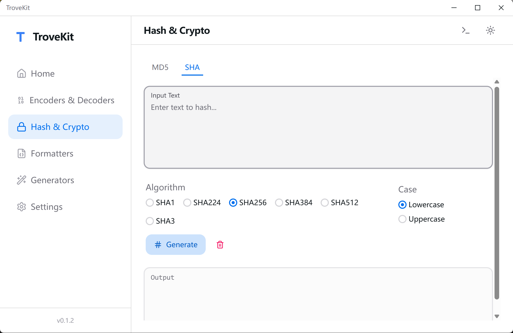
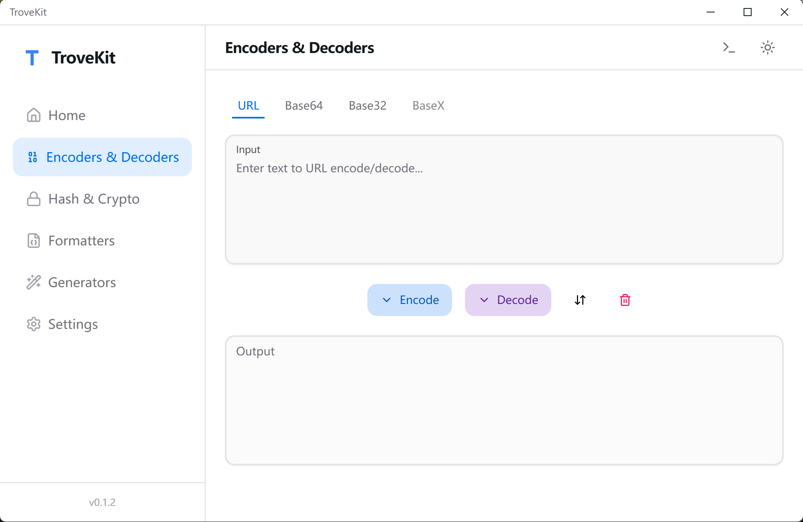
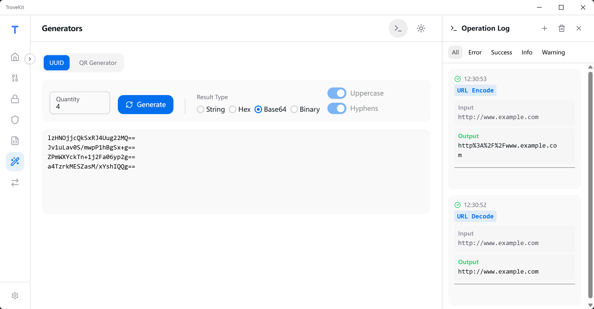
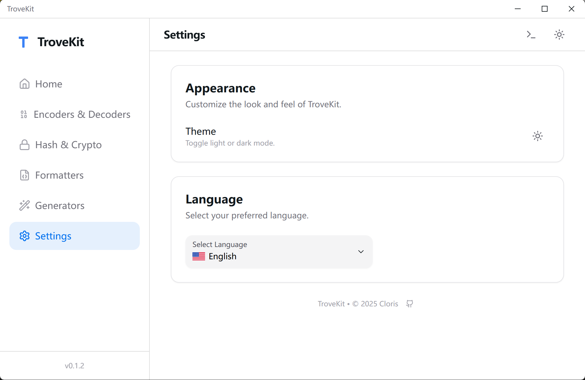

<div align="center">

<h1>TroveKit</h1>

一個開源、輕量、完全離線、跨平台的工具箱。

[English](README.md) | [簡體中文](README.zh-CN.md) | 繁體中文（香港） | [繁體中文（台灣）](README.zh-TW.md) | [日本語](README.ja.md)
</div>

<div align="center">
<a href="https://github.com/1595901624/trovekit/releases"></a>
<a href="https://github.com/1595901624/trovekit/blob/main/LICENSE"></a>


</div>


## 為什麼是 TroveKit

你可能經常需要這些「小工具」：雜湊、加解密、編碼、JSON 格式化、二維碼、簡單古典密碼……
TroveKit 把它們集中到一個桌面應用裡，盡量做到：

- **純離線**：所有資料處理都在本地
- **操作快**：輸入即見結果（支援即時更新）
- **可追溯**：帶操作日誌與一鍵複製
- **跨平台**：Windows / macOS / Linux

TroveKit 基於 [Tauri v2](https://v2.tauri.app/) + [React](https://react.dev/) 建構，主打純離線與高效體驗。

## ✨ 主要功能

- 多工具集合：Hash / AES / DES / RC4 / 編碼解碼 / JSON / XML / YAML / **轉換器** / 二維碼 / 凱撒密碼 / **日誌管理**
- 現代 UI：深淺色主題、響應式佈局、順滑動畫
- **全局功能搜索**：快速查找並導航到應用中的各種工具和功能。
- **可收起側邊欄**：支持側邊欄折疊以最大化工作空間，並自動記憶狀態。
- **增強國際化**：English / 簡體中文 / 繁體中文（HK/TW）/ 日本語，優化文字大小與翻譯質量
- 日誌與提示：操作記錄、錯誤提示、複製按鈕，支援**備註功能**
- **狀態持久化**：自動保存工具配置與內容（防止誤觸丟失）
- **正則工具**：新增即時正則測試，支援語法高亮、匹配組與旗標（flags）設置（已在 v0.2.4 中加入）。

## 🧰 內建工具

### 📷 QR Code Generator（二維碼產生）

- 支援 **文字 / URL** 二維碼
- 支援 **Wi‑Fi 二維碼**（SSID / 密碼 / 加密方式 / 是否隱藏）
- 可調樣式：顏色、糾錯等級、可選 Logo
- 匯出 **PNG**（支援中文等 Unicode 內容）

### 🔐 Classical Ciphers（古典密碼）

- **Bacon Cipher（培根密碼）**：支援標準（26字母）或傳統（24字母）字母表，支援多種符號模式（A/B, 0/1等）
- **Caesar Cipher（凱撒密碼）**：支援編碼 / 解碼、可設定位移
- **Morse Code（摩斯密碼）**：自訂配置（分隔符/長短碼）
- 非字母字元處理：保留 / 忽略 / 按 ASCII 位移（適合做實驗，但可能產生不可見字元）

### 🔒 Hash & Cryptography（雜湊與加解密）

- **MD5 / MD4 / MD2**：16 位元 / 32 位元，大小寫可選
- **HMAC-MD5**：基於 HMAC 的 MD5 雜湊算法支援
- **SHA 家族**：SHA1 / SHA224 / SHA256 / SHA384 / SHA512 / SHA3
- **AES / DES / RC4**：支持多種模式與填充（支援 Hex/Base64 格式）

### 🔢 Encoders & Decoders（編碼與解碼）

- URL / Base64 即時編碼解碼
- **Hex**：支援編碼/解碼，可配置換行模式（LF/CRLF）
- Base32 / Hex(Base16) / Base58 / Base62 / Base91 / 自訂字母表

### 📝 Formatters（格式化）

- **JSON**：格式化 / 壓縮 / 樹狀檢視
- **XML**：格式化 / 壓縮
- **CSS**：格式化 / 壓縮
- **SQL**：格式化 / 壓縮，支援多種 SQL 方言（MySQL、PostgreSQL、SQLite、T-SQL 等）

### 🔄 Converters（轉換器）

- **時間戳轉換**：支援日期與時間戳（秒/毫秒/微秒/納秒）雙向轉換，提供即時高精度系統時鐘。
- **網段計算**：支援 IPv4 CIDR 與子網掩碼轉換，可計算網路位址、廣播位址、主機範圍與主機數量。
- **JSON ↔ XML**：雙向轉換，即時處理
- **JSON ↔ YAML**：雙向轉換，即時處理
- 多種格式語法高亮
- 範例資料支援，快速測試
- 錯誤驗證與友善提示

### 🧾 Logs & Toasts（操作日誌與提示）

- 側邊欄顯示操作歷史記錄，具有**基於會話的持久化（實驗性）**
- **即時自動儲存**：所有操作自動儲存到本地的 **SQLite 資料庫** 中
- 支援**手動建立日誌會話**（新建日誌）
- **備註功能**：可為日誌條目添加註釋/備註，便於更好地記錄上下文和文檔
- **會話備註編輯**：可為日誌會話添加和編輯備註
- **增強日誌交互**：尾隨空白字元使用視覺標記（`·`, `→`, `↵`）高亮顯示，並提供描述性提示
- **重構日誌管理工具**：全新的 **Master-Detail 佈局** 介面，用於查看、搜尋和管理所有已儲存的日誌。支援**刪除單個條目和整個會話**
- **增強 UUID 日誌**：顯示生成的 UUID，支援可配置格式（字串/Hex/Base64/二進位）、大小寫和連字元。在日誌中顯示數量和格式詳情。日誌條目中最多顯示 10 個 UUID，達到限制時會清楚標示
- 結構化的操作方法/輸入/輸出檢視
- 錯誤/成功提示 + 一鍵複製

## 🗺️ Roadmap

- Formatters：YAML
- Generators：Lorem Ipsum / 隨機密碼等

- 文本對比：並排與內嵌文本差異比較，支援忽略空白與詞級差異。
- 常用工具：文本常用工具（大小寫轉換、換行符規範、空白清理等）。

## 📸 Screenshots

| Hash Tool | Encoder Tool |
|:---:|:---:|
|  |  |

| Operation Logs | Settings |
|:---:|:---:|
|  |  |

> 提示：QR / Caesar 的截圖會在後續補充到 demo 圖庫中。

## 🚀 Tech Stack

- **Core**: [Rust](https://www.rust-lang.org/) & [Tauri v2](https://tauri.app/)
- **Frontend**: [React 19](https://react.dev/) & [TypeScript](https://www.typescriptlang.org/)
- **Build Tool**: [Vite](https://vitejs.dev/)
- **UI Framework**: [HeroUI](https://www.heroui.com/) & [Tailwind CSS](https://tailwindcss.com/)
- **State & Logic**: [Framer Motion](https://www.framer.com/motion/), [i18next](https://www.i18next.com/), [crypto-js](https://cryptojs.gitbook.io/)
- **QR Rendering**: [qr-code-styling](https://www.npmjs.com/package/qr-code-styling)
- **XML Processing**: [fast-xml-parser](https://www.npmjs.com/package/fast-xml-parser)

## 🎨 UI / UX

- **Theme**：深淺色主題，支援系統同步
- **Visuals**：基於 **HeroUI** 與 **TailwindCSS** 建構
- **Animations**：由 **Framer Motion** 驅動
- **優化文字大小**：提升所有工具與語言下的可讀性

## 🌍 Internationalization

- **Languages**: English, Simplified Chinese (简体中文), Traditional Chinese (繁體中文 - HK/TW), and Japanese (日本語)

## 🛠️ 快速開始（開發/運行）

### 依賴環境

- Node.js 18+
- pnpm
- Rust（stable）
- Tauri v2 依賴（不同系統要求略有差異；若首次建構失敗，請按 Tauri 官方文件安裝系統依賴）

### 安裝

1. Clone

    - 如果你是从 GitHub 克隆：把下面的地址替换为你自己的仓库地址即可。

    ```bash
    git clone <repo-url>
    cd trovekit
    ```

2. 安裝依賴

    ```bash
    pnpm install
    ```

### 本地開發運行

```bash
pnpm tauri dev
```

### 打包建構

```bash
pnすれば tauri build
```

## 🔒 隱私說明（Privacy）

- TroveKit 的定位是 **純離線工具箱**：所有功能均可離線使用。
- 輸入內容在本地處理；不會向外部伺服器發送任何資料。

## 📂 Project Structure

```
TroveKit/
├── src-tauri/       # Rust backend and Tauri configuration
├── src/             # React frontend source code
│   ├── components/  # UI Components (Sidebar, LogPanel, Toast, etc.)
│   ├── contexts/    # Context Providers (LogContext)
│   ├── tools/       # Tool Views (Hash, Encoder, Formatter, Converter, QR, Classical, Settings)
│   │   ├── converter/  # JSON/XML converter
│   │   └── ...     # Other tool directories
│   ├── locales/     # i18n JSON files
│   ├── lib/         # Utilities (Base32, etc.)
│   └── styles/      # Global CSS
└── public/          # Static assets
```

## 🤝 Contributing

歡迎提交 Issue / PR：

- 新工具建議（例如更多格式化器/生成器/轉換器）
- Bug 修復、UI/UX 改進
- 文案與翻譯優化（`src/locales/`）

## 📄 License

[MIT](LICENSE)